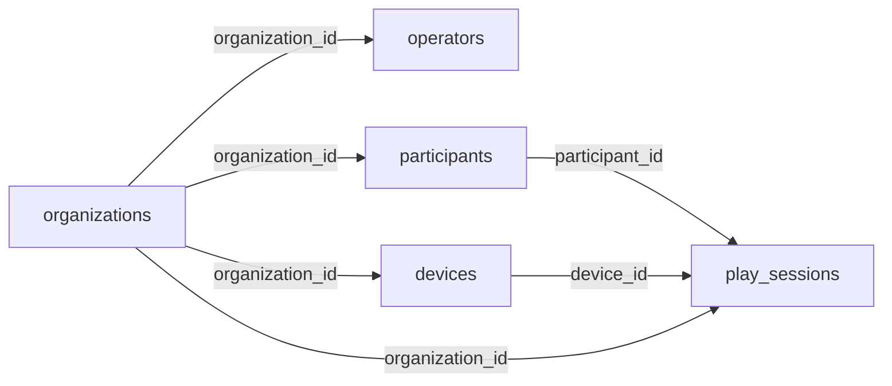

# 신명놀이터 서버 데이터 설계(MongoDB) · API 초안

> 버전: v0.2 (2026-10-08 · MongoDB 컬렉션 설계로 변경) · 작성: 조이랩(게임 개발) · 상태: **검토 요청용 초안**
> 대상: 관리자 웹 · 서버 담당 팀

## 0. 배경과 전제

- 신명놀이터는 비전 카메라로 동작하는 노인용 체감형 운동 게임이다. 게임 3종(수확하기 · 장보기 · 요리하기)이 있고, 1회 참여는 10라운드다.
- 게임은 기관(복지관·경로당 등)에 설치된 **기기(엣지 PC)**에서 실행된다. 사용자·참여 기록 데이터는 **외부 서버**가 저장한다. DB는 **MongoDB**를 쓴다.
- **로그인은 기관·운영자 단위**다. 어르신은 로그인하지 않고, 게임 화면에서 등록된 자기 카드(이름+그림)를 골라 시작한다.
- 등록하지 않은 어르신(비회원)도 참여할 수 있지만 **기록은 저장하지 않는다**.

## 1. 설계 원칙

| # | 원칙 |
|---|---|
| 1 | **기관(organization)이 데이터의 경계**다. 어르신·기기·운영자·기록 문서가 모두 `organization_id`를 갖고, 모든 조회에 기관 조건을 건다 |
| 2 | 어르신은 **기관 소속**이다(기기 소속 아님). 같은 기관의 어느 기기에서 참여해도 기록이 이어진다 |
| 3 | 개인정보는 **이름 · 성별 · 그림 · 카드색**만 저장한다. 나이·생년월일·연락처·사진은 받지 않는다. 성별은 통계 전용이며 조회 조건으로 쓰지 않는다 |
| 4 | 라운드별 **원시 데이터를 저장**하고, 관리자 화면 지표는 조회할 때 계산한다(지표 정의가 바뀌어도 다시 계산 가능) |
| 5 | 참여 기록의 `_id`는 **게임(기기)이 생성한 UUID**다. 네트워크 장애 후 같은 기록을 다시 보내도 중복 저장되지 않아야 한다(멱등) |
| 6 | 점수·등급·순위 필드는 두지 않는다. 결과 코드와 화면 문구에 「실패·오답·틀림」 표현을 쓰지 않는다 |
| 7 | 10라운드를 마친 참여만 기록한다. 중도 종료한 판은 올라오지 않는다 |
| 8 | **1회 참여 = 문서 1개.** 10라운드 상세는 참여 문서 안에 배열로 넣는다(임베드). 항상 함께 쓰고 함께 읽으며, 크기가 작다(1건 수 KB) |

## 2. 컬렉션 구성

| 컬렉션 | 설명 | 문서 단위 |
|---|---|---|
| `organizations` | 기관. 모든 데이터의 경계 | 기관 1개 |
| `operators` | 기관 운영자 계정. 관리자 웹 로그인, **기기 설치 시 1회 로그인**(기기 선택)에 쓴다 | 계정 1개 |
| `devices` | 게임 설치 기기(엣지 PC). **관리자 웹에서 등록**하고, 설치 때 PC에서 골라 연결한다. 설정(`settings`)·최근 상태(`status`)를 임베드 | 기기 1대 |
| `participants` | 등록 어르신 | 어르신 1명 |
| `play_sessions` | 1회 참여(10라운드). 라운드 상세(`rounds`)를 임베드 | 참여 1회 |



- 화살표는 참조(다른 문서의 `_id` 보관)다. MongoDB는 외래 키 제약이 없으므로 참조 무결성(존재하는 어르신·기기인지, 같은 기관인지)은 **API에서 확인**한다.
- `_id` 형식: 서버가 만드는 문서는 `ObjectId`, 게임이 만드는 `play_sessions._id`·`story_run_id`는 **UUID**(BSON Binary subtype 4 권장). API JSON에서는 둘 다 문자열로 주고받는다.
- 시각은 모두 BSON `Date`(UTC 저장)로 두고, 화면 표시는 한국 시간으로 변환한다.

## 3. 문서 구조

### 3-1. organizations

```js
{
  _id: ObjectId,
  name: "○○복지관",              // 기관명
  status: "active",               // active | suspended
  created_at: Date
}
```

### 3-2. operators

```js
{
  _id: ObjectId,
  organization_id: ObjectId,
  username: "joylab01",           // 로그인 아이디 · 전체에서 유일
  password: "$2b$12$...",         // 로그인 비밀번호 · 해시 값으로 저장(bcrypt 등) · 원문 저장 금지
  name: "홍길동",
  role: "owner",                  // owner | staff — owner가 staff 계정을 관리
  is_active: true,
  last_login_at: Date,
  created_at: Date
}
```

### 3-3. devices

```js
{
  _id: ObjectId,
  organization_id: ObjectId,
  name: "1층 프로그램실",          // 설치 위치
  token_hash: null,               // 기기 인증 토큰(원문 저장 안 함) · PC에서 이 기기를 고를 때 발급 · 계정과 무관(5-1)
  token_issued_at: null,          // Date — 연결 전에는 null
  token_issued_by: null,          // operators._id — PC에서 로그인해 이 기기를 고른 운영자
  app_version: "0.9.0",
  created_by: ObjectId,           // operators._id — 관리자 웹에서 등록한 운영자
  created_at: Date,
  last_seen_at: Date,

  settings: {                     // 관리자 웹에서 수정(ADM-008)
    admin_pin_hash: "...",        // 관리 번호 4자리
    volume_level: 2,              // 1~3
    voice_enabled: true,
    updated_at: Date,
    updated_by: ObjectId          // operators._id
  },
  status: {                       // 기기 주기 보고로 덮어쓰기(ADM-001)
    camera_connected: true,
    person_detected: false,
    reported_at: Date
  }
}
```

- 상태 이력이 필요하면 별도 컬렉션 `device_status_logs`를 두고 TTL 인덱스로 일정 기간 뒤 자동 삭제한다.

### 3-4. participants

```js
{
  _id: ObjectId,
  organization_id: ObjectId,
  name: "김순자",                  // 5자 이내
  gender: "F",                    // M | F (통계 전용)
  avatar_index: 3,                // 0~7 (그림 8종)
  card_color_index: 5,            // 0~7 (등록 시 무작위)
  created_by: ObjectId,           // operators._id
  created_at: Date,
  updated_at: Date
}
```

- 등록·수정·삭제는 관리자 웹에서만 한다(게임에는 등록 화면 없음).

### 3-5. play_sessions

공통 필드 + 활동별 `rounds` 배열. `rounds` 원소 모양은 `activity`에 따라 다르다.

```js
{
  _id: UUID,                      // 게임이 생성 (멱등 키)
  organization_id: ObjectId,      // 조회용 (기기 토큰에서 서버가 채움)
  participant_id: ObjectId,
  device_id: ObjectId,            // 기기 토큰에서 서버가 채움
  activity: "harvest",            // harvest | shopping | cooking
  mode: "free",                   // story | free
  story_run_id: null,             // 스토리 3종(수확→장보기→요리)을 묶는 UUID · 개별 게임은 null
  started_at: Date,
  duration_sec: 312.4,            // 일시정지 제외
  paused_sec: 0.0,
  success_count: 9,               // 0~10 (힌트 후 성공 포함)
  hint_count: 2,
  move_left_count: null,          // 장보기만
  move_right_count: null,         // 장보기만
  app_version: "0.9.0",
  uploaded_at: Date,              // 서버 수신 시각
  rounds: [ /* 10개 · 아래 활동별 모양 */ ]
}
```

**수확하기 `rounds[]`**

```js
{ round_no: 1, target_item: "감", picked_item: "감", result: "target", reaction_sec: 4.2, hint_count: 0 }
```

**장보기 `rounds[]`** — 라운드당 목표 재료 1~3개를 `items`로 임베드

```js
{
  round_no: 1,
  round_sec: 18.6,
  items: [
    { seq: 1, target_item: "두부", target_zone: "L1", bought_item: "두부", bought_zone: "L1",
      is_matched: true, arrive_sec: 5.1, hint_count: 0 }
  ]
}
```

**요리하기 `rounds[]`** — 레시피 재료(`answers`)와 담은 재료(`picks`)를 임베드

```js
{
  round_no: 1,
  food: "된장찌개",
  round_sec: 21.0,
  reaction_sec: 3.4,
  review_count: 1,                // 차림표 다시 보기
  hint_count: 0,
  answers: ["된장", "두부", "애호박"],   // 기록 시점의 레시피 재료 (레시피가 바뀌어도 옛 기록 해석 가능)
  picks: [                        // 담은 순서대로
    { seq: 1, item: "두부", is_matched: true },
    { seq: 2, item: "감자", is_matched: false }
  ]
}
```

- 라운드를 임베드한 이유: 10라운드는 항상 한 번에 저장(A2)·조회(1회 상세 ADM-005)되고 개수가 고정이라 문서가 커지지 않는다. 기간·사용자별 통계는 집계 파이프라인(`$match` → `$unwind: "$rounds"` → `$group`)으로 계산한다.
- 작물·재료·음식 이름은 고정 목록이라 문자열로 저장한다. 코드 목록이 필요하면 이름을 키로 붙이면 된다.
- 내려받기(엑셀 등)·통계는 웹에서 처리한다. 이를 위해 라운드마다 「목표 / 실제 선택」을 나란히 볼 수 있도록 목표 값(수확 목표 작물 · 장보기 목표 재료 · 요리 레시피 재료)을 모두 기록한다.
- 입력 검증: 컬렉션에 `$jsonSchema` 검증기(validator)를 걸어 필수 필드·코드값 범위를 지키는 것을 권장한다.

### 3-6. 코드값

| 필드 | 값 | 의미 |
|---|---|---|
| `play_sessions.activity` | `harvest` · `shopping` · `cooking` | 수확하기 · 장보기 · 요리하기 |
| `play_sessions.mode` | `story` · `free` | 스토리 게임(3종 연속) · 개별 게임 |
| `rounds.result` (수확하기) | `target` · `other` · `bug` | 목표 작물 · 다른 작물 · 벌레 먹은 작물 |
| `rounds.items.target_zone` / `bought_zone` (장보기) | `L2` · `L1` · `C` · `R1` · `R2` | 발판 위치(왼쪽 끝 · 왼쪽 · 가운데 · 오른쪽 · 오른쪽 끝) |
| `participants.gender` | `M` · `F` | 통계 전용 |
| `operators.role` | `owner` · `staff` | 기관 관리자 · 운영자 |

- 화면 표시 문구: `other`·`is_matched: false`는 「다른 선택」「다르게 산 재료」로 표시한다(「오답·실패」 금지).

### 3-7. 인덱스

| 컬렉션 | 인덱스 | 용도 |
|---|---|---|
| `operators` | `{ username: 1 }` unique | 로그인 |
| `devices` | `{ token_hash: 1 }` unique (partial — 토큰 있는 문서만) | 기기 토큰 인증 |
| `devices` | `{ organization_id: 1 }` | 기관 기기 목록(ADM-001) |
| `participants` | `{ organization_id: 1, name: 1 }` | 게임의 사용자 선택 화면 · 사용자 관리(ADM-002) |
| `play_sessions` | `{ organization_id: 1, started_at: -1 }` | 참여 기록 목록 기간 필터(ADM-004) · 기관 전체 통계(ADM-006) |
| `play_sessions` | `{ participant_id: 1, started_at: -1 }` | 게임의 내 기록 보기(최근 5회) · 사용자 변화 추이(ADM-003) |
| `play_sessions` | `{ organization_id: 1, activity: 1, mode: 1, started_at: -1 }` | 활동·모드 필터(ADM-004) · 활동별 통계(ADM-006-2) |
| `play_sessions` | `{ story_run_id: 1 }` partial(`story_run_id` 있는 문서만) | 스토리 1회 묶어 보기 |

- 멱등은 `_id` 기본 유일 인덱스로 보장된다(별도 인덱스 불필요).

## 4. 관리자 화면 지표 계산

모든 지표는 **참여 1회 단위로 계산한 뒤 선택한 기간의 평균**을 낸다. 기간 안에 참여가 없으면 0이 아니라 「기록 없음」으로 표시한다.

| 지표 | 수확하기 | 장보기 | 요리하기 |
|---|---|---|---|
| 정확하게 선택 | `success_count` | `rounds.items` 중 `is_matched: true` 수 | `picks`가 모두 `is_matched: true`인 라운드 수 |
| 평균 반응 시간(초) | `rounds.reaction_sec` 평균 | `rounds.items.arrive_sec` 평균 | `rounds.reaction_sec` 평균 |
| 다른 선택 | `rounds.result`가 `target`이 아닌 수 | `is_matched: false` 수 | `is_matched: false`가 섞인 라운드 수 |
| 도움 받은 횟수 | `hint_count` | 〃 | 〃 |

- 힌트를 받고 성공한 경우도 성공에 포함된다. 반응 시간에서 일시정지 시간은 이미 빠져 있다.
- 장보기·요리하기 지표의 세부 정의는 기획 확정값에 맞춰 추후 확정한다(위 표는 데이터로 계산 가능한지 확인한 수준).
- 예: 기간 내 어르신별 수확하기 평균 반응 시간

```js
db.play_sessions.aggregate([
  { $match: { organization_id: orgId, activity: "harvest", started_at: { $gte: from, $lt: to } } },
  { $project: { participant_id: 1, avg_reaction: { $avg: "$rounds.reaction_sec" } } },   // 1회 단위
  { $group: { _id: "$participant_id", avg_reaction: { $avg: "$avg_reaction" }, sessions: { $sum: 1 } } }  // 기간 평균
])
```

## 5. 게임 ↔ 서버 API

HTTP + JSON 가정. D1~D3(설치 시)을 뺀 게임의 모든 호출은 `Authorization: Bearer {기기 토큰}`.

**설치 흐름(PC 1대당 1회):** 운영자 로그인(D1) → 기관에 등록된 기기 목록(D2)에서 이 PC가 맡을 기기 선택 → 그 기기의 토큰 발급(D3) → 이후 게임은 기기 토큰만 쓴다. 기기 생성(이름·설정 등록)은 관리자 웹에서 한다.

| # | 호출 | 시점 | 내용 |
|---|---|---|---|
| D1 | `POST /auth/login` | 설치 시 | 운영자 `username`·`password` → 운영자 토큰(짧은 유효 시간) |
| D2 | `GET /devices` | 설치 시 (운영자 토큰) | 기관에 등록된 기기 목록 (`id`·`name`·`in_use`·`last_seen_at` — 이미 다른 PC가 쓰는 기기 구분용) |
| D3 | `POST /devices/{id}/token` | 설치 시 (운영자 토큰) | 고른 기기의 토큰 발급. 이미 사용 중인 기기는 `replace: true`일 때만 교체(기존 PC 토큰 무효) · 아니면 `409` — 5-1 참조 |
| A1 | `GET /participants` | 사용자 선택 화면 진입 | 기관의 어르신 목록 (`id`·`name`·`gender`·`avatar_index`·`card_color_index`) |
| A2 | `POST /play-sessions` | 10라운드 완주 시 | 참여 1건 + 라운드 상세 (아래 예시). **같은 `id`를 다시 받으면 저장하지 않고 성공으로 응답**(멱등 — `insertOne`의 중복 키 오류 `11000`을 성공으로 처리) |
| A3 | `GET /participants/{id}/play-sessions?limit=5` | 내 기록 보기 진입 | 최근 참여 목록 + 누적 요약(함께한 날 수 · 전체 활동 시간 · 마지막 참여일) |
| B1 | `PUT /devices/me/status` | 주기 보고(예: 1분) | `camera_connected` · `person_detected` → `devices.status` 덮어쓰기 |
| B2 | `GET /devices/me/settings` | 실행 시 · 주기 | 소리 크기 · 음성 안내 · 관리 번호 (`devices.settings`) |

- 응답 시간: 화면 진입 시 호출(A1·A3)은 1초 안 희망.
- 관리자 웹에서 기기로 보내는 명령(프로그램 종료, 카메라 미리보기)은 외부 서버에서 기기로 직접 연결할 수 없으므로 방식(기기가 주기적으로 명령을 조회하는 등)을 따로 협의한다.

### 5-1. 토큰 규칙

토큰은 두 종류이고 서로 독립이다. **기기 토큰은 계정이 아니라 기기에 묶인다.**

| 토큰 | 발급 | 사라지는 경우 | 동시에 여러 개 |
|---|---|---|---|
| 운영자 토큰 | D1 로그인마다 새로 발급 | **만료로만**(예: 30분). 다른 로그인 때문에 지워지지 않는다 | 가능 — 같은 계정이 관리자 웹 · 여러 PC에서 동시에 로그인해도 서로 영향 없음 |
| 기기 토큰 | D3 (기기 1대당 1개) | 같은 기기를 다시 고를 때(D3) · 관리자 웹에서 기기 연결 해제 · 기기 삭제 | 기기마다 1개 |

- **같은 계정 중복 로그인:** D1은 새 운영자 토큰을 하나 더 발급할 뿐이고, 그 계정의 다른 운영자 토큰이나 어떤 기기 토큰도 지우지 않는다. 「마지막 로그인만 유효」 같은 단일 세션 처리를 하지 않는다.
- **기기 토큰은 계정 상태와 무관:** 기기를 연결한 운영자 계정이 로그아웃·비밀번호 변경·비활성화·삭제되어도 기기 토큰은 그대로 유효하다(게임이 멈추지 않게). `token_issued_by`는 기록용이다.
- 운영자 토큰은 서명 토큰(JWT 등)이면 서버에 저장하지 않아도 된다. 저장한다면 별도 컬렉션(`operator_sessions`)에 `expires_at` TTL 인덱스를 두고 계정당 여러 문서를 허용한다.
- **이미 연결된 기기를 다른 PC에서 고를 때:** D2 목록에 `in_use`(토큰 발급됨)를 내려 주어 화면에 「다른 PC에서 사용 중」을 표시하고, D3는 요청에 `replace: true`가 없으면 `409`로 거절한다 — 실수로 다른 PC의 연결을 끊지 않게 한다. 운영자가 확인한 뒤에만 교체(기존 PC의 기기 토큰 무효)한다.

### 5-2. 서버 장애 시 게임 동작

- 어르신 목록은 마지막으로 받은 것을 기기에 보관해 두고, 서버에 연결되지 않아도 사용자 선택 화면을 그대로 보여 준다.
- 참여 기록은 기기에 쌓아 두었다가 연결되면 자동으로 다시 보낸다. 그래서 A2는 반드시 멱등이어야 한다.
- 서버 장애가 게임 이용 불가로 이어지지 않는다.

### 5-3. A2 요청 예시 (수확하기)

요청 본문은 `play_sessions` 문서와 같은 모양이다. 서버는 `id` → `_id`로 옮기고 `organization_id`·`device_id`(기기 토큰에서)·`uploaded_at`을 채워 저장한다.

```json
{
  "id": "6f1c2a9e-3b4d-4f61-9c2e-1a7b8d9e0f12",
  "participant_id": "6702f1a9c3b4d5e6f7a8b9c0",
  "activity": "harvest",
  "mode": "free",
  "story_run_id": null,
  "started_at": "2026-10-07T14:03:21+09:00",
  "duration_sec": 312.4,
  "paused_sec": 0.0,
  "success_count": 9,
  "hint_count": 2,
  "app_version": "0.9.0",
  "rounds": [
    { "round_no": 1, "target_item": "감", "picked_item": "감", "result": "target", "reaction_sec": 4.2, "hint_count": 0 },
    { "round_no": 2, "target_item": "고추", "picked_item": "가지", "result": "other", "reaction_sec": 6.8, "hint_count": 1 }
  ]
}
```

- 장보기는 `rounds: [{ "round_no", "round_sec", "items": [{ "seq", "target_item", "target_zone", "bought_item", "bought_zone", "is_matched", "arrive_sec", "hint_count" }] }]` 와 `move_left_count`·`move_right_count`를 함께 보낸다.
- 요리하기는 `rounds: [{ "round_no", "food", "round_sec", "reaction_sec", "review_count", "hint_count", "answers": ["재료", ...], "picks": [{ "seq", "item", "is_matched" }] }]` 를 보낸다.

## 6. 함께 정할 것

| # | 항목 | 내용 |
|---|---|---|
| 1 | 관리 번호 | 기기의 관리 번호(4자리)를 유지할지, 운영자 로그인으로 대체할지. 유지한다면 모든 기기에 통하는 공용 번호는 두지 않는 것을 제안한다 |
| 2 | 어르신 삭제 시 기록 | 함께 삭제(현재 가정 — MongoDB는 연쇄 삭제가 없으므로 API에서 `play_sessions.deleteMany({ participant_id })`를 함께 실행) 또는 익명화해 통계용으로 보존 |
| 3 | 개인정보 처리 | 외부 서버에 이름·성별을 보관하므로 기관의 개인정보 처리 동의·위탁 절차 확인 |
| 4 | 보존 기간 | 기록 보존 기간(기간이 정해지면 `play_sessions`에 TTL 인덱스 또는 정기 삭제 작업) |
| 5 | 비회원 참여 | 현재 기록하지 않음. 기관 통계(ADM-006 참여 횟수)에 비회원 판을 셀 필요가 있는지 |
| 6 | 서버 → 기기 명령 | 프로그램 종료 · 카메라 미리보기 전달 방식 |
| 7 | UUID 저장 형식 | `play_sessions._id`·`story_run_id`를 BSON UUID(Binary subtype 4)로 둘지 문자열로 둘지(서버 드라이버 기준으로 선택) |
