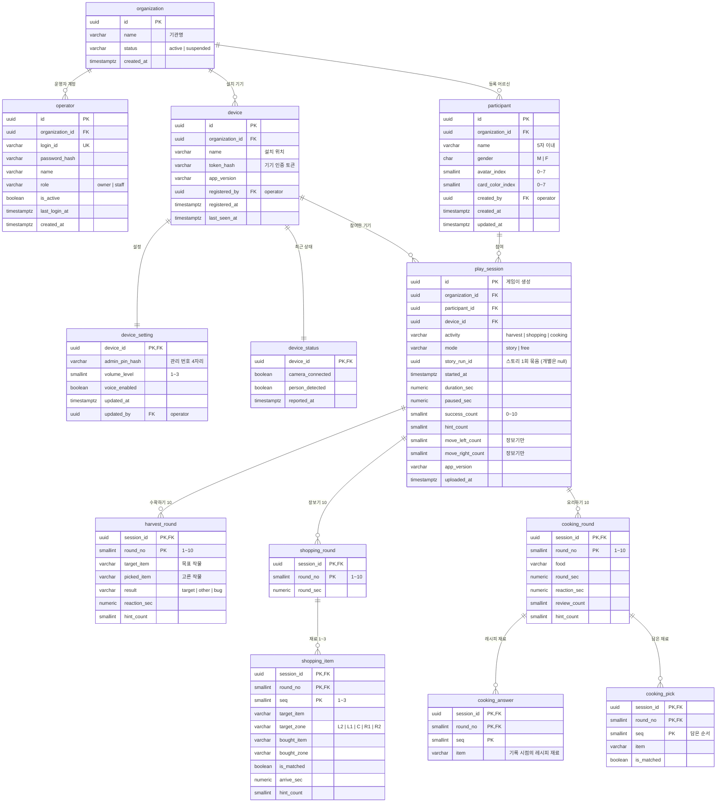

# 신명놀이터 서버 데이터 설계(ERD) · API 초안

> 버전: v0.1 (2026-10-07) · 작성: 조이랩(게임 개발) · 상태: **검토 요청용 초안**
> 대상: 관리자 웹 · 서버 담당 팀

## 0. 배경과 전제

- 신명놀이터는 비전 카메라로 동작하는 노인용 체감형 운동 게임이다. 게임 3종(수확하기 · 장보기 · 요리하기)이 있고, 1회 참여는 10라운드다.
- 게임은 기관(복지관·경로당 등)에 설치된 **기기(엣지 PC)**에서 실행된다. 사용자·참여 기록 데이터는 **외부 서버**가 저장한다.
- **로그인은 기관·운영자 단위**다. 어르신은 로그인하지 않고, 게임 화면에서 등록된 자기 카드(이름+그림)를 골라 시작한다.
- 등록하지 않은 어르신(비회원)도 참여할 수 있지만 **기록은 저장하지 않는다**.

## 1. 설계 원칙

| # | 원칙 |
|---|---|
| 1 | **기관(organization)이 데이터의 경계**다. 어르신·기기·운영자·기록이 모두 기관에 속하고, 다른 기관 데이터는 조회할 수 없다 |
| 2 | 어르신은 **기관 소속**이다(기기 소속 아님). 같은 기관의 어느 기기에서 참여해도 기록이 이어진다 |
| 3 | 개인정보는 **이름 · 성별 · 그림 · 카드색**만 저장한다. 나이·생년월일·연락처·사진은 받지 않는다. 성별은 통계 전용이며 조회 조건으로 쓰지 않는다 |
| 4 | 라운드별 **원시 데이터를 저장**하고, 관리자 화면 지표는 조회할 때 계산한다(지표 정의가 바뀌어도 다시 계산 가능) |
| 5 | 참여 기록 ID는 **게임(기기)이 생성한 UUID**다. 네트워크 장애 후 같은 기록을 다시 보내도 중복 저장되지 않아야 한다(멱등) |
| 6 | 점수·등급·순위 컬럼은 두지 않는다. 결과 코드와 화면 문구에 「실패·오답·틀림」 표현을 쓰지 않는다 |
| 7 | 10라운드를 마친 참여만 기록한다. 중도 종료한 판은 올라오지 않는다 |

## 2. ERD



## 3. 테이블 정의

### 3-1. 기관 · 계정 · 기기

| 테이블 | 설명 | 비고 |
|---|---|---|
| `organization` | 기관. 모든 데이터의 경계 | 기관 생성·정지는 서버 측 관리 기능 |
| `operator` | 기관 운영자 계정. 관리자 웹 로그인, **기기 등록 시 1회 로그인**에 쓴다 | 비밀번호 해시 저장 · `owner`가 `staff` 계정을 관리 |
| `device` | 게임 설치 기기(엣지 PC). 설치할 때 운영자가 기기에서 로그인하면 서버가 **기기 토큰**을 발급하고, 이후 게임은 토큰으로만 호출한다 | 토큰 원문은 저장하지 않음 · 분실·교체 시 재발급 |
| `device_setting` | 기기별 설정: 관리 번호(4자리), 소리 크기(3단계), 음성 안내 켬/끔 | ADM-008 |
| `device_status` | 기기의 최근 상태 1행(덮어쓰기): 카메라 연결, 사람 인식 | ADM-001 · 이력이 필요하면 로그 테이블 추가 |

### 3-2. 어르신 · 참여 기록

| 테이블 | 설명 | 비고 |
|---|---|---|
| `participant` | 등록 어르신. 입력 항목은 이름·성별·그림(8종)이고, 카드색은 등록 시 무작위로 정한다 | ADM-002 · 등록·수정·삭제는 관리자 웹에서만 |
| `play_session` | 1회 참여(10라운드) 1행 | `id`는 게임이 만든 UUID · `organization_id`는 조회용 비정규화 · `story_run_id`는 스토리 게임 3종(수확→장보기→요리)을 한 번의 이야기로 묶는 ID(게임이 생성 · 개별 게임은 null) |
| `harvest_round` | 수확하기 라운드별: 목표 작물, 고른 작물, 결과, 반응 시간, 도움 받은 횟수 | 라운드 10행 |
| `shopping_round` | 장보기 라운드별 수행 시간 | 라운드 10행 |
| `shopping_item` | 장보기 재료별: 목표 재료·발판, 실제로 산 재료·발판, 목표대로 샀는지, 도착 시간, 도움 | 라운드당 목표 1~3개 · 1회 약 20행 |
| `cooking_round` | 요리하기 라운드별: 음식, 수행 시간, 반응 시간, 차림표 다시 보기 횟수, 도움 | 라운드 10행 |
| `cooking_answer` | 그 라운드 음식의 레시피 재료(기록 시점 기준) | 레시피 구성이 바뀌어도 옛 기록을 그대로 해석할 수 있게 함께 저장 |
| `cooking_pick` | 요리하기에서 담은 재료(담은 순서대로)와 레시피 재료 여부 | |

- 라운드 상세를 행으로 나눈 이유: 1회 상세(ADM-005), 사용자 변화 추이(ADM-003-2), 활동별 통계(ADM-006-2)를 SQL 집계로 바로 계산하기 위해서다. JSON 한 덩어리로 저장해도 되지만 기간·사용자별 통계 조회가 느려진다.
- 작물·재료·음식 이름은 고정 목록이라 문자열로 저장한다. 코드 테이블이 필요하면 이름을 키로 붙이면 된다.
- 내려받기(엑셀 등)·통계는 웹에서 처리한다. 이를 위해 라운드마다 「목표 / 실제 선택」을 나란히 볼 수 있도록 목표 값(수확 목표 작물 · 장보기 목표 재료 · 요리 레시피 재료)을 모두 기록한다.

### 3-3. 코드값

| 컬럼 | 값 | 의미 |
|---|---|---|
| `play_session.activity` | `harvest` · `shopping` · `cooking` | 수확하기 · 장보기 · 요리하기 |
| `play_session.mode` | `story` · `free` | 스토리 게임(3종 연속) · 개별 게임 |
| `harvest_round.result` | `target` · `other` · `bug` | 목표 작물 · 다른 작물 · 벌레 먹은 작물 |
| `shopping_item.target_zone` / `bought_zone` | `L2` · `L1` · `C` · `R1` · `R2` | 발판 위치(왼쪽 끝 · 왼쪽 · 가운데 · 오른쪽 · 오른쪽 끝) |
| `participant.gender` | `M` · `F` | 통계 전용 |
| `operator.role` | `owner` · `staff` | 기관 관리자 · 운영자 |

- 화면 표시 문구: `other`·`is_matched = false`는 「다른 선택」「다르게 산 재료」로 표시한다(「오답·실패」 금지).

### 3-4. 주요 인덱스

| 인덱스 | 용도 |
|---|---|
| `play_session (organization_id, started_at)` | 참여 기록 목록 기간 필터(ADM-004) · 기관 전체 통계(ADM-006) |
| `play_session (participant_id, started_at)` | 게임의 내 기록 보기(최근 5회) · 사용자 변화 추이(ADM-003) |
| `play_session (organization_id, activity, mode, started_at)` | 활동·모드 필터(ADM-004) · 활동별 통계(ADM-006-2) |
| `participant (organization_id, name)` | 게임의 사용자 선택 화면 · 사용자 관리(ADM-002) |

## 4. 관리자 화면 지표 계산

모든 지표는 **참여 1회 단위로 계산한 뒤 선택한 기간의 평균**을 낸다. 기간 안에 참여가 없으면 0이 아니라 「기록 없음」으로 표시한다.

| 지표 | 수확하기 | 장보기 | 요리하기 |
|---|---|---|---|
| 정확하게 선택 | `success_count` | `shopping_item.is_matched = true` 수 | 담은 재료가 모두 맞은 라운드 수 |
| 평균 반응 시간(초) | `harvest_round.reaction_sec` 평균 | `shopping_item.arrive_sec` 평균 | `cooking_round.reaction_sec` 평균 |
| 다른 선택 | `result <> 'target'` 수 | `is_matched = false` 수 | 다른 재료가 섞인 라운드 수 |
| 도움 받은 횟수 | `play_session.hint_count` | 〃 | 〃 |

- 힌트를 받고 성공한 경우도 성공에 포함된다. 반응 시간에서 일시정지 시간은 이미 빠져 있다.
- 장보기·요리하기 지표의 세부 정의는 기획 확정값에 맞춰 추후 확정한다(위 표는 데이터로 계산 가능한지 확인한 수준).

## 5. 게임 ↔ 서버 API

HTTP + JSON 가정. 게임의 모든 호출은 `Authorization: Bearer {기기 토큰}`.

| # | 호출 | 시점 | 내용 |
|---|---|---|---|
| D1 | `POST /devices/register` | 설치 시 1회 | 운영자 ID·비밀번호 + 기기 이름 → 기기 토큰 발급 |
| A1 | `GET /participants` | 사용자 선택 화면 진입 | 기관의 어르신 목록 (`id`·`name`·`gender`·`avatar_index`·`card_color_index`) |
| A2 | `POST /play-sessions` | 10라운드 완주 시 | 참여 1건 + 라운드 상세 (아래 예시). **같은 `id`를 다시 받으면 저장하지 않고 성공으로 응답**(멱등) |
| A3 | `GET /participants/{id}/play-sessions?limit=5` | 내 기록 보기 진입 | 최근 참여 목록 + 누적 요약(함께한 날 수 · 전체 활동 시간 · 마지막 참여일) |
| B1 | `PUT /devices/me/status` | 주기 보고(예: 1분) | `camera_connected` · `person_detected` |
| B2 | `GET /devices/me/settings` | 실행 시 · 주기 | 소리 크기 · 음성 안내 · 관리 번호 |

- 응답 시간: 화면 진입 시 호출(A1·A3)은 1초 안 희망.
- 관리자 웹에서 기기로 보내는 명령(프로그램 종료, 카메라 미리보기)은 외부 서버에서 기기로 직접 연결할 수 없으므로 방식(기기가 주기적으로 명령을 조회하는 등)을 따로 협의한다.

### 5-1. 서버 장애 시 게임 동작

- 어르신 목록은 마지막으로 받은 것을 기기에 보관해 두고, 서버에 연결되지 않아도 사용자 선택 화면을 그대로 보여 준다.
- 참여 기록은 기기에 쌓아 두었다가 연결되면 자동으로 다시 보낸다. 그래서 A2는 반드시 멱등이어야 한다.
- 서버 장애가 게임 이용 불가로 이어지지 않는다.

### 5-2. A2 요청 예시 (수확하기)

```json
{
  "id": "6f1c2a9e-3b4d-4f61-9c2e-1a7b8d9e0f12",
  "participant_id": "0b7d3c1e-8a2f-4c55-b1d9-2e6f7a8b9c01",
  "activity": "harvest",
  "mode": "free",
  "story_run_id": null,
  "started_at": "2026-10-07T14:03:21+09:00",
  "duration_sec": 312.4,
  "paused_sec": 0.0,
  "success_count": 9,
  "hint_count": 2,
  "app_version": "0.9.0",
  "harvest_rounds": [
    { "round_no": 1, "target_item": "감", "picked_item": "감", "result": "target", "reaction_sec": 4.2, "hint_count": 0 },
    { "round_no": 2, "target_item": "고추", "picked_item": "가지", "result": "other", "reaction_sec": 6.8, "hint_count": 1 }
  ]
}
```

- 장보기는 `shopping_rounds: [{ "round_no", "round_sec", "items": [{ "seq", "target_item", "target_zone", "bought_item", "bought_zone", "is_matched", "arrive_sec", "hint_count" }] }]` 와 `move_left_count`·`move_right_count`를 함께 보낸다.
- 요리하기는 `cooking_rounds: [{ "round_no", "food", "round_sec", "reaction_sec", "review_count", "hint_count", "answers": ["재료", ...], "picks": [{ "seq", "item", "is_matched" }] }]` 를 보낸다.

## 6. 함께 정할 것

| # | 항목 | 내용 |
|---|---|---|
| 1 | 관리 번호 | 기기의 관리 번호(4자리)를 유지할지, 운영자 로그인으로 대체할지. 유지한다면 모든 기기에 통하는 공용 번호는 두지 않는 것을 제안한다 |
| 2 | 어르신 삭제 시 기록 | 함께 삭제(현재 ERD 가정) 또는 익명화해 통계용으로 보존 |
| 3 | 개인정보 처리 | 외부 서버에 이름·성별을 보관하므로 기관의 개인정보 처리 동의·위탁 절차 확인 |
| 4 | 보존 기간 · 시각 | 기록 보존 기간 · 시각은 시간대 포함(`timestamptz`, 한국 시간)으로 저장 제안 |
| 5 | 비회원 참여 | 현재 기록하지 않음. 기관 통계(ADM-006 참여 횟수)에 비회원 판을 셀 필요가 있는지 |
| 6 | 서버 → 기기 명령 | 프로그램 종료 · 카메라 미리보기 전달 방식 |
