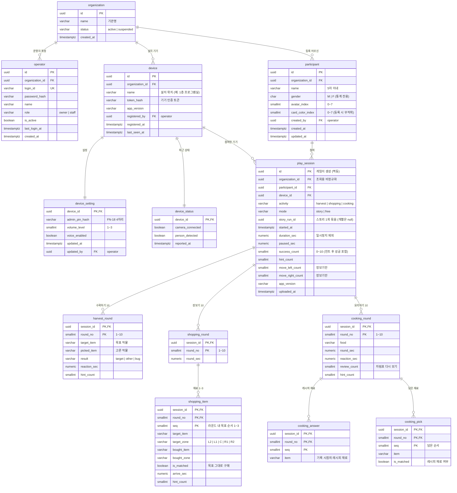

# 서버 데이터 설계(ERD) 초안 — 서버 담당 팀 전달용

> 작성: 2026-10-07 · 상태: **초안** (게임 개발 측 제안 → 서버 팀 검토 · 기획 승인 필요)
> 전제(2026-10-07 결정): **외부 서버** · 로그인은 **기관·운영자 단위**(어르신 개인 로그인 없음 — 어르신은 지금처럼 SCR-003에서 자기 카드를 고른다).
> 관련: `91_관리자웹_연동규격_초안.md`(API·Unity 제공 항목) · `Assets/Scripts/Save/SaveModels.cs`(현재 게임이 쌓는 원시 데이터)

## 0. 설계 원칙

| # | 원칙 | 근거 |
|---|---|---|
| 1 | **기관(organization)이 데이터의 경계** — 어르신·기기·운영자·기록 모두 기관에 속한다. 다른 기관 데이터는 조회 불가 | 외부 서버 · 다기관 운영 |
| 2 | 어르신(participant)은 **기관 소속**이지 기기 소속이 아니다 — 같은 기관 안 어느 기기에서 해도 기록이 이어진다 | FN-17 내 기록 보기 |
| 3 | 개인정보는 **이름·성별·그림·카드색만** — 나이·생년월일·연락처·사진 없음 | 07 문서 18-5 · FN-20 미수집 |
| 4 | **원시 데이터를 저장**하고 지표(정확하게 선택·반응 시간·다른 선택·도움)는 조회 시 계산 — 지표 정의가 바뀌어도 다시 계산 가능 | FN-22 지표 계산 기준 |
| 5 | 참여 기록 ID는 **게임(기기)이 만든다(UUID)** — 서버가 끊겼다 다시 보낼 때 중복 저장되지 않는다(멱등) | 오프라인 폴백 |
| 6 | 점수·등급·순위 컬럼을 두지 않는다 · 결과 코드에 「실패·오답」 표현을 쓰지 않는다 | 03 문서 6-2 · 7장 · FN-21 금지 |
| 7 | 비회원(「처음이신가요」) 참여는 저장하지 않는다 | FN-03 · 6-1 |

## 1. ERD

## 2. 테이블 설명

### 2-1. 기관·계정·기기

| 테이블 | 설명 | 비고 |
|---|---|---|
| `organization` | 기관(복지관·경로당 등). 모든 데이터의 경계 | 기관 생성은 서버 측 관리 기능 |
| `operator` | 기관 운영자 로그인 계정. 관리자 웹 로그인 + **기기 등록 시 1회 로그인** | 비밀번호는 해시 저장 · `owner`가 `staff` 계정 관리 |
| `device` | 엣지 PC(게임 설치 기기). 설치할 때 운영자가 기기에서 로그인 → 서버가 **기기 토큰** 발급 → 이후 게임은 토큰으로만 호출 | 토큰 원문은 저장하지 않음(해시) · 분실·교체 시 재발급 |
| `device_setting` | 기기별 설정 — 관리자 번호(FN-18) · 소리 크기 3단계 · 음성 안내 | ADM-008 · 관리자 번호는 아래 Q2 참고 |
| `device_status` | 기기 최근 상태 1행(덮어쓰기) — 카메라 연결 · 사람 인식 | ADM-001 점검 · 91 문서 B1 · 이력이 필요하면 `device_status_log` 추가 |

### 2-2. 어르신·참여 기록

| 테이블 | 설명 | 비고 |
|---|---|---|
| `participant` | 등록 어르신. 입력 항목은 이름·성별·그림만, 카드색은 등록 시 무작위 | FN-20 · 성별은 통계 전용(조회 조건 금지) |
| `play_session` | 1회 참여(10라운드 완주) 1행. **10라운드를 마친 판만** 올라온다 — 중도 종료는 기록 없음 | 03 문서 6-2 · `id`는 게임이 만든 UUID · `story_run_id` = 스토리 3종을 한 번의 이야기로 묶는 ID(게임 생성 · 개별은 null) |
| `harvest_round` | 수확하기 라운드별 — 목표 작물 · 고른 작물 · 결과 · 반응 시간 · 도움 | `result`: `target`(목표 작물) · `other`(다른 작물) · `bug`(벌레 먹은 작물) |
| `shopping_round` | 장보기 라운드 수행 시간 | 라운드당 목표 1~3개 |
| `shopping_item` | 장보기 재료별 — 목표 재료·발판 · 실제 산 재료·발판 · 그대로 샀는지 · 도착 시간 · 도움 | 1회 참여 약 20건 · 다르게 산 것도 실패가 아니다(확정) |
| `cooking_round` | 요리하기 라운드별 — 음식 · 수행/반응 시간 · 차림표 다시 보기 · 도움 | 반응 시간 = 팝업 닫힘~첫 재료 선택(18-4) |
| `cooking_answer` | 그 라운드 음식의 레시피 재료(기록 시점) | 레시피가 바뀌어도 옛 기록 해석 가능 |
| `cooking_pick` | 요리하기에서 담은 재료(순서대로) · 레시피 재료였는지 | 「재료가 달랐던 음식」 지표 계산용 |

- 라운드 상세를 행으로 나눈 이유: ADM-005(1회 상세)·ADM-003-2(지표 4종)·ADM-006-2(활동별 통계)를 SQL 집계로 바로 계산할 수 있다. JSON 한 덩어리로 저장하는 방식도 가능하지만, 기간·사용자별 통계 조회가 느려진다.
- 작물·재료·음식 이름은 04 게임구성표로 확정된 고정 목록이라 문자열로 둔다. 서버에서 코드 테이블이 필요하면 이름을 키로 붙이면 된다.
- 내려받기(엑셀)·통계는 웹이 원시 데이터로 처리한다(2026-10-07 사용자 결정 — 03 문서 7장 5번 「내보내기 안 함」과 다름, 기획 공유 필요). 라운드마다 목표 값(수확 목표 작물 · 장보기 목표 재료 · 요리 레시피 재료)을 모두 기록한다.

### 2-3. 주요 인덱스

| 인덱스 | 용도 |
|---|---|
| `play_session (organization_id, started_at)` | ADM-004 기간 필터 · ADM-006 기관 전체 통계 |
| `play_session (participant_id, started_at)` | SCR-023 내 기록 보기(최근 5회) · ADM-003 변화 추이 |
| `play_session (organization_id, activity, mode, started_at)` | ADM-004 활동·모드 필터 · ADM-006-2 |
| `participant (organization_id, name)` | SCR-003 사용자 목록 · ADM-002 |

### 2-4. 지표 계산 (서버 조회 시)

| 지표 (FN-22) | 수확하기 | 장보기 | 요리하기 |
|---|---|---|---|
| 정확하게 선택 | `success_count` 평균 | `shopping_item.is_matched` 수 | 모든 담은 재료가 맞은 라운드 수 |
| 평균 반응 시간 | `harvest_round.reaction_sec` 평균 | `shopping_item.arrive_sec` 평균 | `cooking_round.reaction_sec` 평균 |
| 다른 선택 | `result <> 'target'` 수 | `is_matched = false` 수 | 다른 재료가 섞인 라운드 수 |
| 도움 받은 횟수 | `play_session.hint_count` 평균 | 〃 | 〃 |

- 모두 **참여 1회 단위로 계산한 뒤 기간 평균**을 낸다. 기간 안에 참여가 없으면 0이 아니라 「기록 없음」(FN-22).
- 장보기·요리하기 칸의 정확한 정의는 07 문서 9-1 확정값을 따른다. 위 표는 현재 게임 데이터로 계산 가능한지 확인한 수준이다.

## 3. 게임(Unity) ↔ 서버 API (91 문서 1장 갱신)

| # | 호출 | 시점 | 인증 | 내용 |
|---|---|---|---|---|
| D1 | `POST /devices/register` | 설치 시 1회 | 운영자 ID·비밀번호 | 기기 등록 → 기기 토큰 발급 |
| A1 | `GET /participants` | SCR-003 진입 | 기기 토큰 | 기관의 어르신 목록 (id·이름·성별·그림·카드색) |
| A2 | `POST /play-sessions` | 10라운드 완주 | 기기 토큰 | 참여 1건 + 라운드 상세. **같은 `id` 재전송은 성공 응답만 하고 무시**(멱등) |
| A3 | `GET /participants/{id}/play-sessions?limit=5` | SCR-023 진입 | 기기 토큰 | 최근 참여 목록 + 누적 요약(함께한 날·전체 활동 시간·마지막 참여) |
| B1 | `PUT /devices/me/status` | 주기 보고(예: 1분) | 기기 토큰 | 카메라 연결 · 사람 인식 |
| B4 | `GET /devices/me/settings` | 실행 시 · 주기 | 기기 토큰 | 소리 크기 · 음성 안내 · 관리자 번호 |

- **서버가 끊겼을 때(게임 단독 동작):** 어르신 목록은 마지막으로 받은 것을 기기에 캐시해 SCR-003을 그대로 보여 준다. 참여 기록은 기기에 쌓아 두었다가(현재 로컬 저장 `SaveStore` 재사용) 연결되면 자동으로 다시 보낸다. 서버 장애가 게임 이용 불가로 이어지지 않는다(91 문서 P2).
- 어르신 등록·수정·삭제는 관리자 웹에서만 한다(게임에는 등록 화면 없음).
- 91 문서 B2(카메라 미리보기)·B3(프로그램 종료)는 외부 서버에서 기기로 명령을 보내야 하므로 방식(기기가 주기적으로 명령 조회 등)을 따로 협의한다.

## 4. 현재 게임 데이터와의 대응

| 게임 (`SaveModels.cs`) | 서버 |
|---|---|
| `UserProfile` (Id·Name·Gender·AvatarIndex·CardColorIndex·CreatedAt) | `participant` |
| `PlayRecord` (Activity·Mode·StartedAt·DurationSec·PausedSec·SuccessCount·HintCount·MoveLeft/RightCount) | `play_session` — **`SessionId`(UUID) 필드를 게임 쪽에 추가** |
| `HarvestRoundRecord` (Target 2026-10-07 추가) | `harvest_round` (`Result` 한글 값 → 코드 `target/other/bug`) |
| `ShoppingRoundSecs` + `ShoppingItemRecord` | `shopping_round` + `shopping_item` (`Correct` → `is_matched`) |
| `CookingRoundRecord` (Answers 2026-10-07 추가) + `CookingPick` | `cooking_round` + `cooking_answer` + `cooking_pick` |
| (없음 — 서버 연동 시 추가) | `play_session.id`(SessionId) · `story_run_id`(스토리 시작 시 생성) |

## 5. 확인이 필요한 것 (기획·서버 팀)

| # | 항목 | 내용 |
|---|---|---|
| Q1 | **기획 문서 개정** | 07 문서 18-1 「외부 서버 없음」, 03 문서 6-1 「서버 없음」·7장 9번 「네트워크·서버 연동 하지 않음」과 이번 결정(외부 서버)이 충돌 — 기획 승인·개정 필요 |
| Q2 | 관리자 번호(FN-18) | 4자리 번호 + 마스터 `0000` 상시 유효는 로컬 기기 전제의 규칙이다. 외부 서버·운영자 로그인이 생기면 ① 운영자 로그인으로 대체 ② 기기별 번호 유지(마스터 번호 폐기) 중 결정 필요 |
| Q3 | 어르신 삭제 시 기록 | FN-20은 「참여 기록도 함께 지워짐」, 12-2 D1은 익명 보존 안을 협의 중 — 서버 정책으로 확정 필요(현재 ERD는 삭제 시 기록 동반 삭제 가정) |
| Q4 | 개인정보 처리 | 외부 서버에 이름·성별을 보관하게 되므로 기관의 개인정보 처리 동의·위탁 절차 확인 필요 |
| Q5 | 보존 기간·시간대 | 기록 보존 기간 · 시각은 한국 시간 기준(`timestamptz`) 저장 가정 |
| Q6 | 비회원 참여 | 현재 저장 안 함(확정). 기관 통계(ADM-006 참여 횟수)에 비회원 판을 세야 하는지 확인 |
