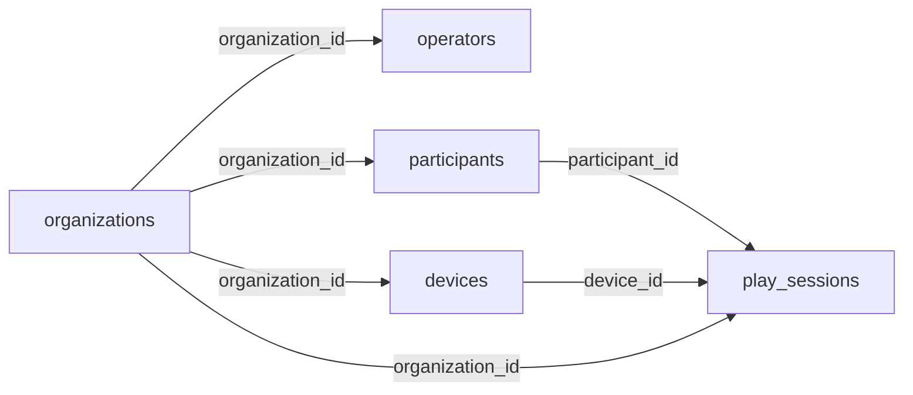

# 서버 데이터 설계(MongoDB) 초안 — 서버 담당 팀 전달용

> 작성: 2026-10-07 · 갱신: 2026-10-08 (**DB = MongoDB** 사용자 결정 → 테이블 설계를 컬렉션·임베드 설계로 변경) · 상태: **초안** (게임 개발 측 제안 → 서버 팀 검토 · 기획 승인 필요)
> 전제(2026-10-07 결정): **외부 서버** · 로그인은 **기관·운영자 단위**(어르신 개인 로그인 없음 — 어르신은 지금처럼 SCR-003에서 자기 카드를 고른다).
> 관련: `93-1_서버_ERD_공유본.md`(서버 팀 전달본 — 이 문서와 함께 갱신) · `91_관리자웹_연동규격_초안.md`(API·Unity 제공 항목) · `Assets/Scripts/Save/SaveModels.cs`(현재 게임이 쌓는 원시 데이터)

## 0. 설계 원칙

| # | 원칙 | 근거 |
|---|---|---|
| 1 | **기관(organization)이 데이터의 경계** — 어르신·기기·운영자·기록 문서가 모두 `organization_id`를 갖고, 모든 조회에 기관 조건을 건다 | 외부 서버 · 다기관 운영 |
| 2 | 어르신(participant)은 **기관 소속**이지 기기 소속이 아니다 — 같은 기관 안 어느 기기에서 해도 기록이 이어진다 | FN-17 내 기록 보기 |
| 3 | 개인정보는 **이름·성별·그림·카드색만** — 나이·생년월일·연락처·사진 없음 | 07 문서 18-5 · FN-20 미수집 |
| 4 | **원시 데이터를 저장**하고 지표(정확하게 선택·반응 시간·다른 선택·도움)는 조회 시 계산 — 지표 정의가 바뀌어도 다시 계산 가능 | FN-22 지표 계산 기준 |
| 5 | 참여 기록 `_id`는 **게임(기기)이 만든다(UUID)** — 서버가 끊겼다 다시 보낼 때 중복 저장되지 않는다(멱등) | 오프라인 폴백 |
| 6 | 점수·등급·순위 필드를 두지 않는다 · 결과 코드에 「실패·오답」 표현을 쓰지 않는다 | 03 문서 6-2 · 7장 · FN-21 금지 |
| 7 | 비회원(「처음이신가요」) 참여는 저장하지 않는다 | FN-03 · 6-1 |
| 8 | **1회 참여 = 문서 1개** — 10라운드 상세는 `rounds` 배열로 임베드(항상 함께 쓰고 읽음 · 1건 수 KB) | MongoDB 결정(2026-10-08) |

## 1. 컬렉션 구성

| 컬렉션 | 설명 | 임베드 | 비고 |
|---|---|---|---|
| `organizations` | 기관(복지관·경로당 등). 모든 데이터의 경계 | — | 기관 생성은 서버 측 관리 기능 |
| `operators` | 기관 운영자 로그인 계정. 관리자 웹 로그인 + **기기 설치 시 1회 로그인**(기기 선택) | — | 로그인 필드 `username`·`password`(해시 값 저장) · `owner`가 `staff` 관리 |
| `devices` | 엣지 PC. **관리자 웹에서 등록** → 설치 때 PC에서 운영자 로그인 후 등록된 기기 중 1대 선택 → **기기 토큰** 발급 → 이후 토큰으로만 호출 | `settings`(FN-18 관리자 번호 · 소리 3단계 · 음성 안내 / ADM-008) · `status`(카메라 연결 · 사람 인식 / ADM-001 · 91 문서 B1, 덮어쓰기) | 토큰 해시 저장(`token_issued_at`·`token_issued_by` · 다시 고르면 교체) · `created_by`/`created_at`은 웹 등록 정보 · 상태 이력이 필요하면 `device_status_logs` + TTL |
| `participants` | 등록 어르신. 이름·성별·그림 입력, 카드색은 등록 시 무작위 | — | FN-20 · 성별은 통계 전용(조회 조건 금지) |
| `play_sessions` | 1회 참여(10라운드 완주) 1문서. **완주한 판만** 올라온다 | `rounds`(활동별 모양 · 장보기는 `items`, 요리하기는 `answers`·`picks`를 다시 임베드) | 03 문서 6-2 · `_id` = 게임 UUID · `story_run_id` = 스토리 3종 묶음 UUID(개별은 null) |

- 참조 무결성(외래 키)이 없으므로 API에서 확인한다 — A2 수신 시 `participant_id`가 기기와 같은 기관인지 검사.
- `_id`: 서버 생성 문서는 `ObjectId`, 게임 생성(`play_sessions._id`·`story_run_id`)은 UUID. 시각은 BSON `Date`(UTC) 저장 · 표시는 한국 시간.
- 문서별 필드 전체·JSON 예시는 공유본 `93-1` 3장에 있다(같은 내용을 두 곳에 쓰지 않음).

### 1-1. play_sessions 모양 요약

| 위치 | 필드 |
|---|---|
| 공통 | `_id`(UUID) · `organization_id` · `participant_id` · `device_id` · `activity`(harvest/shopping/cooking) · `mode`(story/free) · `story_run_id` · `started_at` · `duration_sec`(일시정지 제외) · `paused_sec` · `success_count`(힌트 후 성공 포함) · `hint_count` · `move_left_count`/`move_right_count`(장보기만) · `app_version` · `uploaded_at` · `rounds[]` |
| 수확하기 `rounds[]` | `round_no` · `target_item` · `picked_item` · `result`(`target`/`other`/`bug`) · `reaction_sec` · `hint_count` |
| 장보기 `rounds[]` | `round_no` · `round_sec` · `items[]`{ `seq` · `target_item` · `target_zone`(L2/L1/C/R1/R2) · `bought_item` · `bought_zone` · `is_matched` · `arrive_sec` · `hint_count` } — 다르게 산 것도 실패가 아니다(확정) |
| 요리하기 `rounds[]` | `round_no` · `food` · `round_sec` · `reaction_sec`(팝업 닫힘~첫 재료 선택, 18-4) · `review_count`(차림표 다시 보기) · `hint_count` · `answers[]`(기록 시점 레시피 재료) · `picks[]`{ `seq` · `item` · `is_matched` } |

- 임베드 이유: ADM-005(1회 상세)는 문서 1개 조회로 끝나고, ADM-003-2(지표 4종)·ADM-006-2(활동별 통계)는 집계 파이프라인(`$match` → `$unwind: "$rounds"` → `$group`)으로 계산한다. 라운드 수가 10으로 고정이라 문서 크기 걱정이 없다.
- 작물·재료·음식 이름은 04 게임구성표로 확정된 고정 목록이라 문자열로 둔다.
- 내려받기(엑셀)·통계는 웹이 원시 데이터로 처리한다(2026-10-07 사용자 결정 — 03 문서 7장 5번 「내보내기 안 함」과 다름, 기획 공유 필요). 라운드마다 목표 값(수확 목표 작물 · 장보기 목표 재료 · 요리 레시피 재료)을 모두 기록한다.

### 1-2. 인덱스

| 컬렉션 | 인덱스 | 용도 |
|---|---|---|
| `operators` | `{ username: 1 }` unique | 로그인 |
| `devices` | `{ token_hash: 1 }` unique · `{ organization_id: 1 }` | 기기 인증 · ADM-001 |
| `participants` | `{ organization_id: 1, name: 1 }` | SCR-003 사용자 목록 · ADM-002 |
| `play_sessions` | `{ organization_id: 1, started_at: -1 }` | ADM-004 기간 필터 · ADM-006 기관 전체 통계 |
| `play_sessions` | `{ participant_id: 1, started_at: -1 }` | SCR-023 내 기록 보기(최근 5회) · ADM-003 변화 추이 |
| `play_sessions` | `{ organization_id: 1, activity: 1, mode: 1, started_at: -1 }` | ADM-004 활동·모드 필터 · ADM-006-2 |
| `play_sessions` | `{ story_run_id: 1 }` partial | 스토리 1회 묶어 보기 |

- 멱등은 `_id` 기본 유일 인덱스로 보장 — A2는 `insertOne` 후 중복 키 오류(`11000`)를 성공으로 응답.

### 1-3. 지표 계산 (서버 조회 시)

| 지표 (FN-22) | 수확하기 | 장보기 | 요리하기 |
|---|---|---|---|
| 정확하게 선택 | `success_count` 평균 | `rounds.items.is_matched: true` 수 | `picks`가 모두 맞은 라운드 수 |
| 평균 반응 시간 | `rounds.reaction_sec` 평균 | `rounds.items.arrive_sec` 평균 | `rounds.reaction_sec` 평균 |
| 다른 선택 | `rounds.result ≠ target` 수 | `is_matched: false` 수 | 다른 재료가 섞인 라운드 수 |
| 도움 받은 횟수 | `hint_count` 평균 | 〃 | 〃 |

- 모두 **참여 1회 단위로 계산한 뒤 기간 평균**을 낸다. 기간 안에 참여가 없으면 0이 아니라 「기록 없음」(FN-22). 집계 예시는 공유본 4장.
- 장보기·요리하기 칸의 정확한 정의는 07 문서 9-1 확정값을 따른다. 위 표는 현재 게임 데이터로 계산 가능한지 확인한 수준이다.

## 2. 게임(Unity) ↔ 서버 API (91 문서 1장 갱신)

| # | 호출 | 시점 | 인증 | 내용 |
|---|---|---|---|---|
| D1 | `POST /auth/login` | 설치 시 · LOGIN 화면 | 운영자 `username`·`password` | 운영자 토큰(짧은 유효) |
| D2 | `GET /devices` | 설치 시 · DEVICE_SELECT 화면 | 운영자 토큰 | 기관에 등록된 기기 목록 |
| D3 | `POST /devices/{id}/token` | 설치 시 · 기기 확정 | 운영자 토큰 | 고른 기기의 토큰 발급 · 사용 중인 기기는 `replace: true`일 때만 교체 |
| A1 | `GET /participants` | SCR-003 진입 | 기기 토큰 | 기관의 어르신 목록 (id·이름·성별·그림·카드색) |
| A2 | `POST /play-sessions` | 10라운드 완주 | 기기 토큰 | 참여 1건 + `rounds`(본문 = `play_sessions` 문서 모양). **같은 `id` 재전송은 성공 응답만 하고 무시**(멱등) |
| A3 | `GET /participants/{id}/play-sessions?limit=5` | SCR-023 진입 | 기기 토큰 | 최근 참여 목록 + 누적 요약(함께한 날·전체 활동 시간·마지막 참여) |
| B1 | `PUT /devices/me/status` | 주기 보고(예: 1분) | 기기 토큰 | 카메라 연결 · 사람 인식 → `devices.status` |
| B4 | `GET /devices/me/settings` | 실행 시 · 주기 | 기기 토큰 | 소리 크기 · 음성 안내 · 관리자 번호 (`devices.settings`) |

- **서버가 끊겼을 때(게임 단독 동작):** 어르신 목록은 마지막으로 받은 것을 기기에 캐시해 SCR-003을 그대로 보여 준다. 참여 기록은 기기에 쌓아 두었다가(현재 로컬 저장 `SaveStore` 재사용) 연결되면 자동으로 다시 보낸다. 서버 장애가 게임 이용 불가로 이어지지 않는다(91 문서 P2).
- **토큰 규칙(2026-10-08 사용자 결정 · 공유본 5-1):** 같은 계정으로 중복 로그인해도 기존 토큰을 지우지 않는다 — 운영자 토큰은 로그인마다 추가 발급 · 만료로만 소멸, 기기 토큰은 계정이 아니라 기기에 묶여 계정 로그아웃·비밀번호 변경과 무관. 기기 토큰이 바뀌는 건 같은 기기를 다시 고를 때(확인 후 `replace`)·웹에서 연결 해제할 때뿐
- 설치 흐름(2026-10-08 사용자 결정): 게임 첫 화면에서 운영자 로그인 → 등록된 기기 선택 → SCR-001. 기기 생성은 관리자 웹 몫. Unity 더미 구현 `LoginScreen`·`DeviceSelectScreen`·`DeviceAuth`(서버 연동 시 `DeviceAuth` 내부만 교체). **관리 화면을 TV에 띄우지 않는다(18-1)와 다름 — 기획 공유 필요.** 마우스 커서는 이 두 화면에서만 표시
- 어르신 등록·수정·삭제는 관리자 웹에서만 한다(게임에는 등록 화면 없음).
- 91 문서 B2(카메라 미리보기)·B3(프로그램 종료)는 외부 서버에서 기기로 명령을 보내야 하므로 방식(기기가 주기적으로 명령 조회 등)을 따로 협의한다.

## 3. 현재 게임 데이터와의 대응

| 게임 (`SaveModels.cs`) | 서버 |
|---|---|
| `UserProfile` (Id·Name·Gender·AvatarIndex·CardColorIndex·CreatedAt) | `participants` 문서 |
| `PlayRecord` (Activity·Mode·StartedAt·DurationSec·PausedSec·SuccessCount·HintCount·MoveLeft/RightCount) | `play_sessions` 공통 필드 — **`SessionId`(UUID) 필드를 게임 쪽에 추가** |
| `HarvestRoundRecord` (Target 2026-10-07 추가) | 수확하기 `rounds[]` (`Result` 한글 값 → 코드 `target/other/bug`) |
| `ShoppingRoundSecs` + `ShoppingItemRecord` | 장보기 `rounds[]` + `rounds[].items[]` (`Correct` → `is_matched`) — 게임은 라운드 시간과 재료를 따로 들고 있으므로 전송 시 라운드별로 묶는다 |
| `CookingRoundRecord` (Answers 2026-10-07 추가) + `CookingPick` | 요리하기 `rounds[]` + `answers[]` + `picks[]` |
| (없음 — 서버 연동 시 추가) | `play_sessions._id`(SessionId) · `story_run_id`(스토리 시작 시 생성) |

## 4. 확인이 필요한 것 (기획·서버 팀)

| # | 항목 | 내용 |
|---|---|---|
| Q1 | **기획 문서 개정** | 07 문서 18-1 「외부 서버 없음」, 03 문서 6-1 「서버 없음」·7장 9번 「네트워크·서버 연동 하지 않음」과 이번 결정(외부 서버)이 충돌 — 기획 승인·개정 필요 |
| Q2 | 관리자 번호(FN-18) | 4자리 번호 + 마스터 `0000` 상시 유효는 로컬 기기 전제의 규칙이다. 외부 서버·운영자 로그인이 생기면 ① 운영자 로그인으로 대체 ② 기기별 번호 유지(마스터 번호 폐기) 중 결정 필요 |
| Q3 | 어르신 삭제 시 기록 | FN-20은 「참여 기록도 함께 지워짐」, 12-2 D1은 익명 보존 안을 협의 중 — 서버 정책으로 확정 필요(현재 가정: 함께 삭제 · MongoDB는 연쇄 삭제가 없어 API에서 `deleteMany` 동반 실행) |
| Q4 | 개인정보 처리 | 외부 서버에 이름·성별을 보관하게 되므로 기관의 개인정보 처리 동의·위탁 절차 확인 필요 |
| Q5 | 보존 기간 | 기록 보존 기간 미정 — 정해지면 TTL 인덱스 또는 정기 삭제 |
| Q6 | 비회원 참여 | 현재 저장 안 함(확정). 기관 통계(ADM-006 참여 횟수)에 비회원 판을 세야 하는지 확인 |
| Q7 | UUID 저장 형식 | BSON UUID(Binary subtype 4) 또는 문자열 — 서버 드라이버 기준으로 서버 팀이 선택 |
